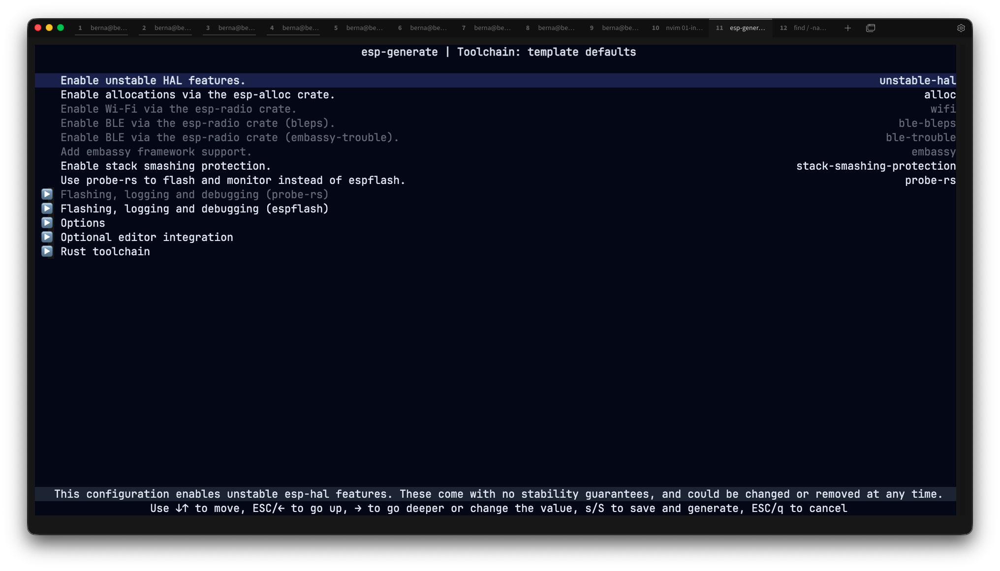

# Introduzione

## La famiglia di schede ESP32

Se sei alle prime armi e stai cercando una scheda ESP32 da acquistare, potresti sentirti sopraffatto dalle numerose opzioni e varianti disponibili.

In questa sezione, esploreremo queste varianti.

### Varianti System on Chip (SoC)

La famiglia di schede ESP32 è composta dalle seguenti varianti SoC:

- ESP32
- ESP32 S Series(ESP32-S2, ESP32-S3)
- ESP32 C Series(ESP32-C3, ESP32-C6, ESP32-C5)
- ESP32 H Series(ESP32-H2)
- ESP32-P Series(ESP32-P4)

Puoi trovare un elenco completo di questi modelli e le relative specifiche nella [pagina di confronto prodotti](https://products.espressif.com/#/product-comparison) di Espressif.


### System on Chip (SoC) vs Module vs Development Board (Devkit)

L'ESP32 è disponibile in tre diverse versioni: System on Chip (SoC), Module e Development Board (Devkit).
Ognuna di esse ha uno scopo specifico ed è adatta a diverse fasi di sviluppo o integrazione.


#### System on Chip (SoC)

Il SoC è il cuore e la forma più fondamentale dell'ESP32.
Un System on Chip integra i componenti essenziali di un sistema elettronico o di un computer in un singolo circuito integrato (IC).
Nel caso del SoC ESP32, include:

- **CPU (Central Processing Unit)**
- **Wi-Fi e Bluetooth**
- **ROM e SRAM**
- **Periferiche aggiuntive**

> [!TIP]
> I SoC sono principalmente progettati per l'integrazione in progetti hardware personalizzati.
> Sono ideali per i produttori che desiderano integrare le funzionalità ESP32 nei propri prodotti.
> Tuttavia, poiché il SoC di per sé non è pre-certificato per la conformità normativa, è necessario ottenere certificazioni (ad esempio, FCC, CE, ...) quando si progetta hardware personalizzato per la comunicazione wireless.

#### Module

I moduli si basano sul SoC e offrono una soluzione più intuitiva e pronta all'uso.
Esempi comuni di moduli ESP32 includono le popolari **WROOM** e **WROVER**.
Ad esempio, l'**ESP32-WROOM-32** è ampiamente utilizzato e riconoscibile come componente quadrato con involucro metallico su molte schede di sviluppo.

Perchè scegliere un modulo?

- **Pre-certificazione**: i moduli sono pre-certificati per la conformità normativa, con conseguente risparmio di tempo e fatica.
- **Componenti integrati**: includono antenne PCB, un oscillatore al cristallo e un chip di memoria flash.
- **Design schermato**: i moduli sono dotati di uno schermo EMI per ridurre le interferenze elettromagnetiche.

> [!TIP]
> I moduli sono progettati per l'integrazione in PCB personalizzati e sono perfetti per applicazioni che richiedono meno componenti esterni e meno sforzi rispetto all'utilizzo di un SoC grezzo.

#### Development Board (Devkit)

Le schede di sviluppo semplificano l'uso dei moduli ESP32 per la prototipazione e lo sviluppo.
Includono componenti aggiuntivi per rendere il modulo ESP32 più facile da usare sia per i principianti che per gli sviluppatori esperti.

Caratteristiche principali delle schede di sviluppo:

- **Interfaccia USB**: consente una facile programmazione e debug
- **Regolatori di tensione**: garantiscono un funzionamento stabile per l'ESP32
- **Breakout dei pin**: rendono accessibili i pin dell'ESP32 per il collegamento di componenti esterni come sensori e display
- **Pulsanti di avvio e reset**: forniscono il controllo sulle operazioni del modulo

> [!TIP]
> I Devkit sono ideali per la prototipazione rapida e la sperimentazione.
> Esempi popolari includono **ESP32 DevKit v1** ed **ESP32-S3-DevkitC**, ampiamente utilizzati da sviluppatori e hobbisti.

### Perchè usiamo la scheda **ESP32 Devkit v1**?

Nonostante l'esistenza di tante varianti, la scheda più utilizzata per imparare e prototipare velocemente rimane l'**ESP32 Devkit v1**.


L'ESP32 è un processore dual-core a 32 bit dotato di Wi-Fi e Bluetooth, perfetto per creare applicazioni IoT wireless.

Di seguito sono riportate le specifiche di base per l'ESP32:

- Processore: Xtensa LX6 a 32 bit 
- Numero di core: 2 
- Frequenza di clock: 240 MHz 
- Memoria flash: 4 MB 
- ROM: 448 KB (programmi di sola lettura essenziali per il funzionamento dell'ESP32)
- SRAM: 520 KB (per memorizzare dati e istruzioni)
- ADC: ADC SAR a 12 bit, 18 canali, 6 pin di ingresso 
- UART: 3 
- SPI: 2 
- I2C: 3 
- Wi-Fi: IEEE 802.11 b/g/n/e/i (802.11n fino a 150 Mbps) 
- Bluetooth: v4.2 BR/EDR e Bluetooth Low Energy (BLE)
- Tensione di funzionamento: 2,3-3,6 V
- Deep Sleep: 100 uA

## ESP32 Pinout


## Development Environment

La [documentazione ufficiale](https://docs.espressif.com/projects/rust/book/getting-started/index.html) fornisce istruzioni di configurazione più complete.
Tuttavia, illustrerò brevemente gli strumenti essenziali e la configurazione necessaria per il nostro corso.

> [!WARNING]
> In caso di problemi, consultate la documentazione ufficiale.

### Comandi

Di seguito è riportata la lista dei comandi per scaricare tutto il necessario per sviluppare il firmware di questo corso:


```bash
# Utile per velocizzare l'installazione dei tool di sviluppo; non influisce sul processo di build del firmware.
cargo install cargo-binstall

# `espflash` è tool di flashing seriale, basato su `esptool.py`, per SoC e moduli Espressif. Questo è lo strumento utilizzato (quando non utilizziamo `probe-rs`) per inserire il nostro codice nel dispositivo ed eseguirlo.
cargo binstall espflash
# espflash --version

# Il tool `esp-generate` viene utilizzato per creare applicazioni `no_std`.
# Attualmente supporta ESP32, ESP32-C2/C3/C6, ESP32-H2 ed ESP32-S2/S3.
cargo binstall esp-generate --locked
# Sostituisci `PROJECT_NAME` e `esp32` con la scheda ESP32 utilizzata e col nome del progetto.
# esp-generate --chip esp32 PROJECT_NAME

# Avrai anche bisogno di `espup` per installare le toolchain necessarie: Xtensa e RISC-V.
cargo binstall espup
espup install

# Configurazione globale dell'ESP toolchain
echo '. ~/export-esp.sh' >> ~/.zshrc

# Controlla se tutto è andato a buon fine.
which xtensa-esp32-elf-gcc
```

### Hello Embedded World!

Prima di addentrarci nella teoria e nei concetti di funzionamento, passiamo direttamente all'azione.
Utilizzate questo semplice codice per accendere il LED integrato (`GPIO2`) dell'**ESP32 DevKit v1**.

Per creare un nuovo progetto usiamo il comando:

```bash
esp-generate --chip esp32 esp32-quick
```

Si aprità la seguente finestra:



Per ora, non è necessario selezionare alcuna opzione, quindi salviamo premendo <kbd>s</kbd> sulla tastiera.

Infine vi sarà posta la seguente domanda:

```bash
Do you want to run `cargo install esp-config --features=tui --locked` now? [y/N]
```

e nuovamente premiamo <kbd>N</kbd> sulla tastiera.

Successivamente entriamo nella cartella del progetto usando il comando:

```bash
cd esp32-quick
```

Ora apriamo il file `src/bin/main.rs` all'interno del quale ci sarà del codice generato automaticamente.
Bene, sostituiamo tutto il codice con il seguente:

```rust
#![no_std]
#![no_main]
#![deny(
    clippy::mem_forget,
    reason = "mem::forget is generally not safe to do with esp_hal types, especially those \
    holding buffers for the duration of a data transfer."
)]

use esp_hal::clock::CpuClock;
use esp_hal::gpio::{Level, Output, OutputConfig};
use esp_hal::main;
use esp_hal::time::{Duration, Instant};

#[panic_handler]
fn panic(_: &core::panic::PanicInfo) -> ! {
    loop {}
}

// This creates a default app-descriptor required by the esp-idf bootloader.
// For more information see: <https://docs.espressif.com/projects/esp-idf/en/stable/esp32/api-reference/system/app_image_format.html#application-description>
esp_bootloader_esp_idf::esp_app_desc!();

#[main]
fn main() -> ! {

    let config = esp_hal::Config::default().with_cpu_clock(CpuClock::max());
    let peripherals = esp_hal::init(config);

    let mut led = Output::new(peripherals.GPIO2, Level::High, OutputConfig::default());

    loop {
        led.toggle();

        blocking_delay(Duration::from_millis(500));
    }

}

fn blocking_delay(duration: Duration) {
    let delay_start = Instant::now();
    while delay_start.elapsed() < duration {}
}
```

> [!WARNING]
> Per ora non preoccupatevi del codice, spiegheremo tutto nel prossimo capitolo.
> Quello che voglio mostrarvi in questa lezione è la semplicità nell'uso del linguaggio Rust nel mondo Embedded.

Non ci resta che caricare il codice sulla nostra ESP32, usando il seguente comando:

```bash
cargo run
```

E dopo qualche secondo vedremo il LED integrato (`GPIO2`) lampeggiare.

## Livelli di astrazione

> [!CAUTION]
> Work in progress.

